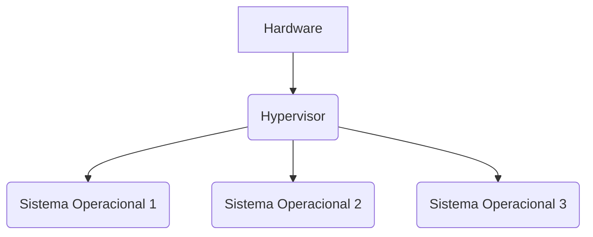

# Aula 01 - Preparando o WSL2 para o curso

## Objetivo

Nessa aula vamos preparar o ambiente de desenvolvimento para o curso PotyStack. Vamos instalar o Python, o Poetry e o FastAPI, além de mais algumas ferramentas que serão úteis ao longo do curso.

## Pré-requisitos

Neste curso vamos tomar como base que você já tenha conhecimentos básicos de programação e saiba como instalar programas no seu sistema operacional. De uma forma ou de outra, vamos tentar ser o mais didáticos possível, mas se você tiver alguma dificuldade, não hesite em nos chamar.

Como base, vamos usar o ambiente windows com o wsl2, mas você pode usar o sistema operacional que preferir.

Estamos usando o Windows como base somente porque a maioria das pessoas que estão começando a programar no Brasil usam Windows. Se você usa Linux ou MacOS, fique tranquilo, pois vamos tentar ser o mais abrangente possível.

## Virtualização

Antes de começarmos a instalar as ferramentas, vamos falar um pouco sobre virtualização. Esse conceito é muito importante uma vez que neste curso vamos usar várias ferramentas que dependem de virtualização.

A virtualização é uma técnica que permite criar uma versão virtual de um dispositivo ou recurso, como um servidor, um sistema operacional, um dispositivo de armazenamento ou uma rede. A virtualização é comumente usada para criar ambientes de teste ou desenvolvimento que não afetam o ambiente na qual você está trabalhando.

Basicamente, o processo de virturalização cria uma camada de abstração entre o hardware e o sistema operacional, permitindo que você execute vários sistemas operacionais em um único hardware.

Essa tecnologia é possivel graças a um software chamado de hipervisor, que, através de uma camada de abstração, composta por uma série de APIs, permite que sistemas operacionais sejam meio que *"enganados"* a acreditar que estão rodando em um hardware real.



Para saber mais sobre virtualização esse [artigo](https://www.redhat.com/pt-br/topics/virtualization/what-is-virtualization) da Red Hat traz uma explicação mais detalhada. Outro artigo interessante é esse [aqui](https://pt.wikipedia.org/wiki/Virtualiza%C3%A7%C3%A3o) da WikiPedia.

## Instalando o WSL2

Para instalar o WSL2, siga o tutorial oficial da Microsoft: [Instalar o WSL 2](https://docs.microsoft.com/pt-br/windows/wsl/install)

Aqui vamos fazer um resumo do que você precisa fazer para instalar o WSL2 e algumas dicas que podem te ajudar.

A distribuição que vamos usar é o Ubuntu 22.04 LTS, mas você pode usar a distribuição que preferir.

Para instalar o Ubuntu 22.04 LTS, precisaremos realizar diversos passos. Vamos lá!

### Validando se o Hyper-V está habilitado

Para validar se o Hyper-V está habilitado, abra o terminal. Para isso, pressione `Win + R` e digite `cmd` e pressione `Enter`.

No terminal, digite o seguinte comando:

```bash title="Validando se o Hyper-V está habilitado"
systeminfo | find "Hyper-V"
```
O comando acima vai retornar se o Hyper-V está habilitado ou não. Se o Hyper-V estiver habilitado, você verá a seguinte mensagem:

```bash
Hyper-V Requirements:      VM Monitor Mode Extensions: Yes
                           Virtualization Enabled In Firmware: Yes
                           Second Level Address Translation: Yes
                           Data Execution Prevention Available: Yes
```
??? info "Observação"
    Esses dados irão variar de acordo com a sua máquina e a linguagem do seu sistema operacional.

??? danger "Habilitando o Hyper-V (caso não esteja habilitado)"

    Esse passo é mais complicado e pode variar de acordo com a sua máquina. O que vai determinar como você vai habilitar o Hyper-V é o fabricante do processador da sua máquina.

    ##### Habilitando o Hyper-V em processadores Intel

    1. Reinicie o computador e acesse a BIOS (para isso pressione uma dessas teclas: `F2`, `F10`, `DEL` ou `ESC`, isso pode variar de acordo com a marca de sua máquina).
    2. Procure por pela opção `Advanced` ou `CPU Configuration`.
    3. Procure por `Intel Virtualization Technology`, `Intel VT-x` ou `Intel VT-d` e habilite essa opção.
    4. Salve as configurações e reinicie o computador.
    5. Após reiniciar, abra o terminal e digite o comando `systeminfo | find "Hyper-V"` para verificar se o Hyper-V foi habilitado.

    ##### Habilitando o Hyper-V em processadores AMD

    1. Reinicie o computador e acesse a BIOS (para isso pressione uma dessas teclas: `F2`, `F10`, `DEL` ou `ESC`, isso pode variar de acordo com a marca de sua máquina).
    2. Procure por pela opção `Advanced` ou `CPU Configuration`.
    3. Procure por `SVM Mode`, `AMD-V` ou `Virtualization Technology` e habilite essa opção.
    4. Salve as configurações e reinicie o computador.
    5. Após reiniciar, abra o terminal e digite o comando `systeminfo | find "Hyper-V"` para verificar se o Hyper-V foi habilitado.

    !!! bug "Observação"
        A habilitação do Hyper-V em maquinas que usam o processador AMD podem gerar algum conflito, principalmente se a solução de virtualização do seu processador for a `AMD-V`. Nesse caso, você pode desabilitar a virtualização através de software. Para isso você precisa abrir o prompt de comando como administrador e digitar o seguinte comando: `bcdedit /set hypervisorlaunchtype off`. Após isso, reinicie o computador.

### Validando requisitos do seu sistema operacional

Para o uso do WSL2, é necessário que o seu sistema operacional seja compatível. Esses passos são para usuários do Windows 10, caso você esteja usando o Windows 11, pule para o próximo passo.

1. Abra o terminal e digite o seguinte comando:

```bash title="Verificando a versão do Windows"
winver
```

2. O comando acima vai abrir uma janela com a versão do Windows que você está usando. Se você estiver usando o Windows 10, verifique se a versão é a 1903 (build 18362) ou superior. Caso você esteja usando uma versão inferior, você pode seguir os passos de habilitação do WSL2 seguindo o tutorial oficial da Microsoft: [Instalar o WSL](https://learn.microsoft.com/pt-br/windows/wsl/install-manual)

### Habilitando o WSL2

Ufa! Agora que você já validou se o Hyper-V está habilitado e se o seu sistema operacional é compatível, vamos habilitar o WSL2.

Para habilitar o WSL2, vamos usar um outro tipo de terminal do windows, o PowerShell. Para evitar problemas de permissão, abra o PowerShell como administrador. Abra o seu menu iniciar e digite `PowerShell`, clique com o botão direito do mouse sobre o ícone do PowerShell e clique em `Executar como administrador`.

No PowerShell, digite o seguinte comando:

```bash title="Habilitando o WSL2"
wsl --install
```

Esse processo pode demorar um pouco, então tenha paciência. O que está acontecendo é que o Windows está baixando e instalando o WSL2. Durante esse processo algumas janelas de confirmação vão aparecer, clique em `Sim` ou `Yes` para confirmar.

Ao final do processo, será exibira uma mensagem pedindo para reiniciar o computador. 

Para reiniciar o seu computador, você pode usar o `Menu Iniciar` e clicar em `Reiniciar`, ou usar um jeito mais dev para reiniciar o computador, que é digitar o seguinte comando no PowerShell:

```bash title="Reiniciando o computador"
Restart-Computer
```

Esse processo de reinicialização pode demorar um pouco, uma vez que o Windows está configurando o WSL2.

Esse procedimento que fizemos até agora de habilitar o WSL2 já realiza a instalação de uma distribuição do Linux.

### Instalando o Ubuntu 22.04 LTS

Esse passo é bem simples. Abra o `Menu Iniciar` e digite `Ubuntu`. Clique no ícone do Ubuntu e aguarde a instalação.

Durante a instalação, você será solicitado a criar um usuário e uma senha. Essas informações são importantes, então guarde-as em um lugar seguro.


???+ warning "Passo importante"

    Recomenda-se que antes de utilizar o wsl2 que você realize esse passo para que sua máquina tenha a configuração correta do WSL2, executando o seguinte comando no `PowerShell`:

    
    ```bash title="Fixando a versão do WSL2"
    wsl --set-default-version 2
    ```

??? tips "Dica"
    Outra forma de instalar o Ubuntu ou outra distribuição do Linux é através dos seguintes comandos no PowerShell:

    ```bash title="Listando as versões disponíveis"
    wsl --list --online
    ```
    Neste comando você receberá como retorno uma lista de distribuições disponíveis para instalação. 

    Escolha a distribuição que você deseja instalar (no nosso caso a Ubuntu 22.04) e execute o seguinte comando:
    ```bash title="Instalando o Ubuntu 22.04 LTS"
    wsl --install -d <<nome_da_distribuição>>
    ```

### Acessando o Ubuntu e Atualizando o Sistema

Para acessar o Ubuntu, abra o `Menu Iniciar` e digite `Ubuntu`. Clique no ícone do Ubuntu e aguarde a inicialização.

Ao acessar o Ubuntu, você vai ver uma tela de boas-vindas. Nessa tela, você pode escolher o seu nome de usuário e a sua senha (*Caso não tenha feito anteriormente*). Depois de fazer isso, você vai ver o terminal do Ubuntu.

A instalação do Ubuntu para o WSL2 é bem simples, então você não vai precisar de muitas configurações. Vale lembrar que o Ubuntu que você instalou é uma versão do Ubuntu para o WSL2, então ele não tem interface gráfica, apenas o terminal.

Vamos começar realizando a atualição o sistema, para isso digite o seguinte comando:

```bash title="Atualizando a lista de pacotes"
sudo apt update # (1)!
```

1. :man_raising_hand: entenda o comando:
    - `sudo`: é um comando que permite que você execute comandos como superusuário, devido a isso, você precisa digitar a senha do usuário que você criou durante a instalação do Ubuntu. Ah... no Linux, diferente de outros sistemas, o terminal não mostra os caracteres da senha, então digite a senha e pressione `Enter`;
    - `apt`: é o gerenciador de pacotes do Ubuntu;
    - `update`: é o comando que atualiza a lista de pacotes disponíveis.

Depois de atualizar a lista de pacotes, vamos atualizar os pacotes do sistema. Para isso, digite o seguinte comando:

```bash title="Atualizando os pacotes do sistema"
sudo apt upgrade -y # (1)!
```

1. :man_raising_hand: entenda o comando:
    - `sudo`: é um comando que permite que você execute comandos como superusuário.
    - `apt`: é o gerenciador de pacotes do Ubuntu;
    - `upgrade`: é o comando que atualiza os pacotes do sistema;
    - `-y`: é uma opção que faz com que o sistema não peça confirmação para atualizar os pacotes.

### Instalando algumas dependências

Como falamos anteriormente a instalação do Ubuntu para o WSL2 é bem simples, mas para que possamos instalar o Python e outras ferramentas, precisamos instalar algumas dependências. Para isso, digite o seguinte comando:

```bash title="Instalando dependências"
sudo apt install -y build-essential libssl-dev zlib1g-dev \
                    libsqlite3-dev libreadline-dev \
                    lzma liblzma-dev libbz2-dev \
                    tk libtk tk-dev libffi-dev # (1)!
```

1. :man_raising_hand: entenda o comando:
    - `sudo`: é um comando que permite que você execute comandos como superusuário.
    - `apt`: é o gerenciador de pacotes do Ubuntu;
    - `install`: é o comando que instala pacotes no Ubuntu;
    - `-y`: é uma opção que faz com que o sistema não peça confirmação para instalar os pacotes;
    - `build-essential`: é um pacote que contém várias ferramentas necessárias para compilar programas;
    - `libssl-dev`: é o pacote que contém as bibliotecas de desenvolvimento do OpenSSL;
    - `zlib1g-dev`: é o pacote que contém as bibliotecas de desenvolvimento do zlib;
    - `liblzma-dev`: é o pacote que contém as bibliotecas de desenvolvimento do LZMA;
    - `libsqlite3-dev`: é o pacote que contém as bibliotecas de desenvolvimento do SQLite3;
    - `libreadline-dev`: é o pacote que contém as bibliotecas de desenvolvimento do Readline;
    - `lzma`: é o pacote que contém o LZMA;
    - `libbz2-dev`: é o pacote que contém as bibliotecas de desenvolvimento do BZ2;
    - `tk`: é o pacote que contém o TK;
    - `libtk`: é o pacote que contém as bibliotecas do TK;
    - `tk-dev`: é o pacote que contém as bibliotecas de desenvolvimento do TK;
    - `libffi-dev`: é o pacote que contém as bibliotecas de desenvolvimento do FFI.

## Instalando o Pyenv

O Linux já vem com o Python instalado, uma vez que muitas ferramentas do sistema dependem dele. Para verificar se o Python está instalado, abra o terminal e digite:

```bash title="Verificando a versão do Python"
python3 --version # (1)!
```

1. :man_raising_hand: aqui você vai ver a versão do Python que está instalada no seu sistema, mais ou menos com a seguintes mensagem: `Python 3.12.3`.

???+ abstract "Um pequeno detalhe que ajuda muito"

    No Linux, devido a compatibilidade com ferramentas do sistema, o Python é chamado de `python3`. Isso é uma forma de garantir que as ferramentas do sistema não sejam afetadas por uma versão mais nova do Python.

    mas por questões de praticidade, vamos criar um alias para o Python. Para isso, abra o terminal e digite:

    ```bash title="Criando um alias para o Python"
    echo "alias python=python3" >> ~/.bashrc
    ```
    Feito isso, para que a configuração tenha efeito, você precisa reiniciar o terminal. Para isso, digite:

    ```bash title="Recarregando o ~/.bashrc"
    source ~/.bashrc
    ```
    Agora você pode usar o comando `python` para chamar o Python.


Perceba que é uma versão mais antiga que a versão mais nova do python. Isso acontece porque o Linux precisa de uma versão mais antiga para compatabilidade com ferramentas do sistema.

Para nós isso pode ser um problema, uma vez que instalar uma versão mais nova do python sobre a versão que o sistema operacional precisa pode causar alguns problemas.

Para resolver isso, vamos instalar o Python usando o `pyenv`.

### Instalando o Pyenv para gerenciar as versões do Python

O [**`pyenv`**](https://github.com/pyenv/pyenv) é uma ferramentjson que permite instalar e gerenciar várias versões do Python no mesmo sistema. Para instalar o `pyenv`, abra o terminal e digite:

```bash title="Instalando o Pyenv"
curl -fsSL https://pyenv.run | bash
```

Esse comando deve apresentar o seguinte resultado:

```text
Cloning into '/home/<<nome_usuario>>/.pyenv'...
remote: Enumerating objects: 1337, done.
remote: Counting objects: 100% (1337/1337), done.
remote: Compressing objects: 100% (718/718), done.
remote: Total 1337 (delta 798), reused 779 (delta 486), pack-reused 0 (from 0)
Receiving objects: 100% (1337/1337), 1.13 MiB | 7.76 MiB/s, done.
Resolving deltas: 100% (798/798), done.
Cloning into '/home/<<nome_usuario>>/.pyenv/plugins/pyenv-doctor'...
remote: Enumerating objects: 11, done.
remote: Counting objects: 100% (11/11), done.
remote: Compressing objects: 100% (9/9), done.
remote: Total 11 (delta 1), reused 5 (delta 0), pack-reused 0 (from 0)
Receiving objects: 100% (11/11), 38.72 KiB | 360.00 KiB/s, done.
Resolving deltas: 100% (1/1), done.
Cloning into '/home/<<nome_usuario>>/.pyenv/plugins/pyenv-update'...
remote: Enumerating objects: 10, done.
remote: Counting objects: 100% (10/10), done.
remote: Compressing objects: 100% (6/6), done.
remote: Total 10 (delta 1), reused 5 (delta 0), pack-reused 0 (from 0)
Receiving objects: 100% (10/10), done.
Resolving deltas: 100% (1/1), done.
Cloning into '/home/<<nome_usuario>>/.pyenv/plugins/pyenv-virtualenv'...
remote: Enumerating objects: 64, done.
remote: Counting objects: 100% (64/64), done.
remote: Compressing objects: 100% (57/57), done.
remote: Total 64 (delta 10), reused 22 (delta 0), pack-reused 0 (from 0)
Receiving objects: 100% (64/64), 43.08 KiB | 3.31 MiB/s, done.
Resolving deltas: 100% (10/10), done.

WARNING: seems you still have not added 'pyenv' to the load path.

# Load pyenv automatically by appending
# the following to
# ~/.bash_profile if it exists, otherwise ~/.profile (for login shells)
# and ~/.bashrc (for interactive shells) :

export PYENV_ROOT="$HOME/.pyenv"
[[ -d $PYENV_ROOT/bin ]] && export PATH="$PYENV_ROOT/bin:$PATH"
eval "$(pyenv init - bash)"

# Restart your shell for the changes to take effect.

# Load pyenv-virtualenv automatically by adding
# the following to ~/.bashrc:

eval "$(pyenv virtualenv-init -)"
```

Vamos dar uma analisada no que aconteceu:

1. O `pyenv` foi clonado para a pasta `~/.pyenv`;
2. Foram clonados alguns plugins do `pyenv` para a pasta `~/.pyenv/plugins`;
3. Foi apresentada uma mensagem de aviso informando que você precisa adicionar o `pyenv` ao seu `~/.bash_profile` ou `~/.profile` (para shells de login) e `~/.bashrc` (para shells interativos);
4. Foi apresentada uma mensagem de aviso informando que você precisa adicionar o `pyenv-virtualenv` ao seu `~/.bashrc`.

No nosso caso, vamos adicionar o `pyenv` ao nosso `~/.bashrc` e o `pyenv-virtualenv` ao nosso `~/.bashrc`.

Para isso, no terminal do Linux, digite:

```bash title="Adicionando o pyenv ao ~/.bashrc"
nano ~/.bashrc
```

Isso vai abrir o editor de texto `nano` com o conteúdo do seu `~/.bashrc`. No final do arquivo, adicione as seguintes linhas:

```bash
export PYENV_ROOT="$HOME/.pyenv"
[[ -d $PYENV_ROOT/bin ]] && export PATH="$PYENV_ROOT/bin:$PATH"
eval "$(pyenv init - bash)"
```

Depois de adicionar essas linhas, pressione `Ctrl + O` para salvar o arquivo e `Ctrl + X` para sair do editor.

Feito isso, para que a configuração tenha efeito, você precisa reiniciar o terminal. Para isso, digite:

```bash title="Recarregando o ~/.bashrc"
source ~/.bashrc
```

Um bom artigo que explica melhor o que é o pyenv e como ele funciona é foi feito pelo [Real Python](https://realpython.com/intro-to-pyenv/).

## Configurando o Git

o [**`Git`**](https://git-scm.com/) é uma ferramenta de controle de versão que permite que você controle as versões dos seus arquivos. O `Git` é uma ferramenta muito importante para quem trabalha com desenvolvimento de software, uma vez que ele permite que você mantenha um histórico de todas as alterações que você fez em um arquivo.

Todo linux já vem com o `Git` instalado, agora o que precisamos fazer é configura-lo. Para isso, abra o terminal e digite:

```bash title="Configurando o Git"
git config --global user.name "Seu Nome" # (1)!
git config --global user.email "seu@email.com" # (2)!
git config --global init.defaultBranch main # (3)!
```

1. :man_raising_hand: Entendendo o comando:
    - `git`: é o comando do `Git`;
    - `config`: é o comando que permite que você configure o `Git`;
    - `--global`: é a opção que faz com que a configuração seja global, ou seja, ela vale para todos os repositórios que você criar;
    - `user.name`: é a chave que define o nome do usuário;
    - `"Seu Nome"`: é o valor que você vai atribuir a chave `user.name`
2. :man_raising_hand: Entendendo o comando:
    - `user.email`: é a chave que define o email do usuário;
    - `"seu@email.com"`: é o valor que você vai atribuir a chave `user.email
3. :man_raising_hand: Entendendo o comando:
    - `init.defaultBranch`: é a chave que define a branch padrão do `Git`;
    - `main`: é o valor que você vai atribuir a chave `init.defaultBranch`. Isso é importante porque o `Git` mudou a branch padrão de `master` para `main`.

### Fazendo com que seu `Git` converse com um repositorio do GitHub.

Ter o seu código apenas em sua máquina é bom, mas é melhor ainda quando você pode compartilhar seu código com outras pessoas. Para isso vamos precisar de um repositorio remoto. E o GitHub é um dos lugares mais populares para se fazer isso.

!!! tip "Caso você não tenha uma conta no git hub"
    Vamos precisar que você tenha uma conta no GitHub. Se você não tem, crie uma conta no [GitHub](https://github.com/) e crie uma conta.

Para fazer com que o seu `Git` converse com o GitHub, você vai precisar de um token de acesso. Para isso, siga os passos abaixo:

1. Acesse o [GitHub](https://github.com/) e faça login na sua conta;
2. Clique na sua foto de perfil no canto superior direito e vá em `Settings`;
3. No menu lateral, clique em `Developer settings`;
4. No menu lateral, clique em `Personal access tokens` e em seguida clique em `Tokens(Classic)`;
5. Clique em `Generate new token`;
6. Dê um nome para o seu token e selecione as permissões que você deseja dar para esse token. No nosso caso, vamos selecionar as permissões `repo` e `workflow`;
7. Clique em `Generate token` e copie o token gerado; 
8. Agora vamos configurar o `Git` para usar esse token. Para isso, abra o terminal e digite:
    ```bash title="Configurando o Git para usar o token"
    git config --global credential.helper cache # (1)!
    ```
    1. :man_raising_hand: Entendendo o comando:
        - `credential.helper`: é a chave que define o helper de credenciais do `Git`;
        - `cache`: é o valor que você vai atribuir a chave `credential.helper`. Esse helper vai armazenar as credenciais em cache;

!!! danger ":warning: Atenção :warning:"
    Ess token gerado nesses passos é o que permite que uma maquina se conect em seu github, portanto **NUNCA**, **NUNCA** compartilhe esse token com qualquer pessoa. Caso por um descuido você compartilhe esse token, vá até o github e delete esse token.

#### Testando a conexão

Vamos fazer um simples teste para ver se a conexão com o GitHub está funcionando. Para isso, vamos clonar um repositório de teste. Para isso, abra o terminal e digite:

```bash title="Clonando um repositório de teste"
git clone https://github.com/code-umbu/PotyStack.git # (1)!
```
1. :man_raising_hand: Entendendo o comando:
    - `git`: é o comando do `Git`;
    - `clone`: é o comando que permite que você clone um repositório;
    - `https://github.com/code-umbu/PotyStack.git`: é o endereço do repositório que você quer clonar.

Se tudo estiver funcionando corretamente, você deve ver uma mensagem parecida com essa:

```bash
Cloning into 'PotyStack'...
remote: Enumerating objects: 3, done.
remote: Counting objects: 100% (3/3), done.
remote: Compressing objects: 100% (3/3), done.
remote: Total 3 (delta 0), reused 0 (delta 0), pack-reused 0
Receiving objects: 100% (3/3), done.
```

Provavelmente você vai ver uma pasta chamada `PotyStack` na pasta onde você está no terminal. Isso significa que o `Git` está funcionando corretamente e você está pronto para começar a trabalhar com o GitHub.
