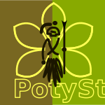
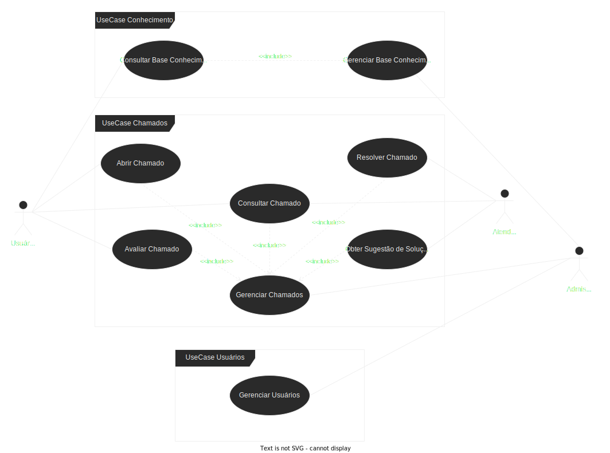

# PotyStack

Um Curso Brasileiro de Full Stack para ser divertido e gostoso de aprender

## Porque PotyStack?

***PotyStack*** é um nome que carrega identidade, resiliência e uma conexão profunda com a cultura brasileira. Inspirado na palavra tupi-guarani "[poty](https://pt.wiktionary.org/wiki/poty)", que significa flor, o nome representa crescimento, aprendizado e evolução — elementos essenciais para qualquer desenvolvedor full stack.

Além disso, Poty faz referência aos [Potiguaras](https://pt.wikipedia.org/wiki/Potiguar), um povo indígena conhecido por sua força, estratégia e adaptabilidade. Assim como um guerreiro Potiguara precisava dominar diferentes habilidades para sobreviver e prosperar, um desenvolvedor full stack deve transitar com maestria entre o back-end e o front-end, encarando desafios com inteligência e criatividade.

Unindo tradição e tecnologia, ***PotyStack*** simboliza um desenvolvimento sólido, resiliente e alinhado à diversidade do Brasil.

## Sobre o Curso

O ***PotyStack*** é um curso de desenvolvimento full stack que tem como objetivo ensinar a criar aplicações web modernas e completas, desde o back-end até o front-end.

O curso é dividido em módulos que abordam diferentes tecnologias e conceitos, permitindo que você aprenda a criar aplicações completas e funcionais, além de entender como cada parte do sistema se conecta e interage.

## Quem é o público-alvo?

O curso é voltado para quem deseja aprender a desenvolver aplicações web completas, desde o back-end até o front-end. Se você é um iniciante na área de desenvolvimento web ou deseja aprimorar suas habilidades, o ***PotyStack*** é o curso ideal para você.

## O que vamos desenvolver?

Como as pessoas que estão escrevendo e ministrando esse cursos são pessoas que estão muito ligadas a disciplina de Gestão de Tecnologia da Informação, que basicamente inclui processos ligados ao ITIL, COBIT, PMBOK, Agile, DevOps, entre outros, vamos criar um sistema básico de registro de chamados de TI.

Daqui por diante vamos chamar esse sistema de ***#TamoJunto***. Abaixo um diagrama de caso de uso do que esse sistema deve fazer:

## O que você vai encontrar aqui para aprender?

Nesse cursos vamos focar nas seguintes tecnologias:

| Tema | Tecnologia |
|------|------------|
| Back-end | :material-check-all:Python, :material-check-all:Poetry,  :material-check-all:FastAPI, :material-check-all:Pydantic, :material-check-all:Pydentic-settings :material-check-all:SQLAlchemy, :material-check-all:Alembic, :material-check-all:PostgreSQL,  :material-check-all:Celery, :material-check-all:RabitMQ, :material-check-all:Redis,  :material-check-all:Docker,  :material-check-all:DockerCompose|
| Front-end | :material-check-all:HTML, :material-check-all:CSS, :material-check-all:JavaScript,  :material-check-all:Angular, :material-check-all:Bootstrap, :material-check-all:Material Design, :material-check-all:Node.js |
| DevOps | :material-check-all:Git, :material-check-all:GitHub, :material-check-all:GitHub Actions |
| Monitoramento | :material-check-all:Grafana, :material-check-all:Prometheus, :material-check-all:OpenTelemetry |

## Como vai funcionar o curso?

O curso será dividido em dois módulos principais:

- **Back-end**: Em back-end vamos focar em python e um conjunto de frameworks, além de outras tecnologias que fazem parte desse mundo de back-end.  Para isso vamos divir esse aprendizado dois submódulos: 
    - **APIs Síncronas**: Vamos aprender a criar APIs com FastAPI, um framework moderno e rápido para criação de APIs e fazer a integração com banco de dados PostgreSQL. 
    - **APIs Assíncronas**: Vamos aprender a criar tarefas assíncronas com Celery e RabbitMQ. Aqui tabém vamos aprender a fazer a integração com um modelo de inteligência artificial.

- **Front-end**: Em front-end vamos focar em HTML, CSS e JavaScript, além de frameworks modernos como Angular e Bootstrap.  Para isso vamos dividir esse aprendizado em dois submódulos:
    - **Web Design**: Vamos aprender a criar páginas web responsivas e bonitas com HTML, CSS e Bootstrap.
    - **Web Development**: Vamos aprender a criar aplicações web dinâmicas com Angular e Node.js.

