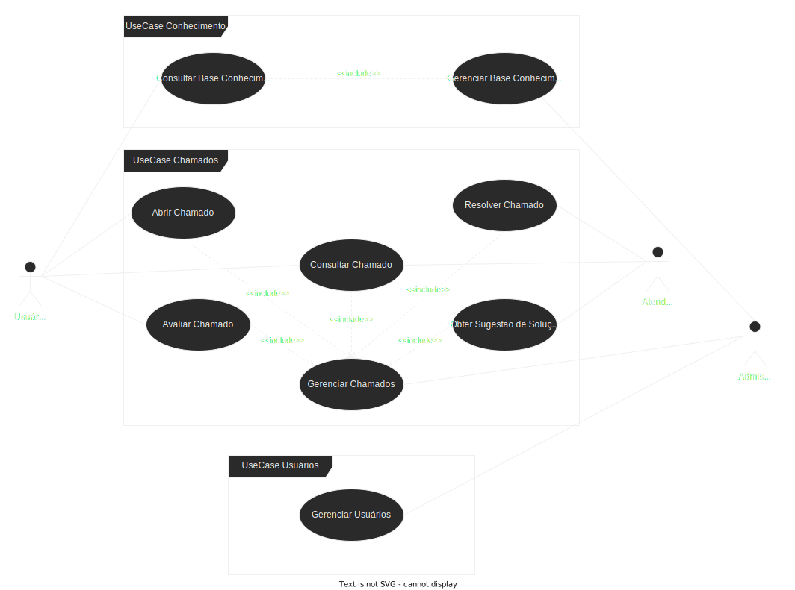

# #TamoJunto Chamados de TI

O ***#TamoJunto*** é um sistema básico de registro de chamados de TI. Nosso objetivo aqui não é fazer o melhor sistemas de chamados de TI do mundo, mas sim aprender a criar um sistema completo, desde o back-end até o front-end. Portanto vai com calma sobre as críticas ao sistema, pois o foco aqui é o aprendizado.

Como vimos anteriormente, na introdução do curso, o ***#TamoJunto*** possuí o seguinte diagrama de caso de uso:

## O que é um Caso de Uso?

Caso de uso é um dos digramas mais importantes da [UML (Unified Modeling Language)](https://pt.wikipedia.org/wiki/UML). 

Um diagrama de caso de uso mostra um conjunto de casos de uso e atores (um tipo especial de classe) e seus relacionamentos. Esses diagramas são utilizados para para ilustrar uma visão estática do  uso de um sistema. Essa demonstração estática é importante porque demonstra de uma forma simples como o sistema será utilizado, por quem e quais são as funcionalidades que ele deve ter.

O diagrama caso de uso em sí basicamente tem dois símbolos: 

- um elipse (que é o caso de uso)
- um ator (que é quem vai utilizar o caso de uso)

## Entendendo o Diagrama de Caso de Uso do #TamoJunto

O diagrama de caso de uso do ***#TamoJunto*** é bem simples. Ele mostra que o sistema terá três atores: o **Usuário**, o **Atendente** e o **Administrador**.

O **Usuário** é quem vai abrir os chamados de TI. Ele vai informar o problema que está enfrentando e o sistema vai cadastrar esse chamado e informar o número do chamado para o usuário. Obviamente o usuário também vai poder consultar os chamados que foram abertos por ele. Uma outra funcionalidade que o usuário vai ter é a de poder avaliar o atendimento que ele recebeu. Além dessas funcionalidades relacionadas a chamados, o usuário também vai poder acessar uma base de conhecimento onde ele pode consultar textos que vão ajudar a resolver problemas comuns.

O **Atendente** é quem vai resolver os chamados de TI. Ele vai poder consultar os chamados que estão abertos e vai poder resolver esses chamados. Além disso, o atendente vai poder ter acesso a uma funcionalidade de que vai sugerir soluções para os chamados que estão abertos. Na parte de base de conhecimento, o atendente vai poder criar novos textos que vão ajudar a resolver problemas comuns.

O **Administrador** é quem vai gerenciar o sistema. Ele vai poder cadastrar os usuários, dar permissões para os atendentes e administradores, além de poder realizar qualquer operação que os outros atores fazem.

Parece simples, não é? Mas acredite temos muito o que aprender para fazer esse sistema funcionar. Vamos em frente!

## Arquiteura do Sistema

O desenho a seguir mostra a arquitetura do sistema ***#TamoJunto***:

Vamos descrever essa imagem acima:

- Temos um polvo no canto superior esquerdo. Esse polvo esta segurando um monte de conteiner azuis. Esse é o simbolo do DokerCompose, que é uma forma bem simplificada de orquestrar vários conteineres Docker. Esse logo do DockerCompose esta limitando um quadrado que contem um monte de coisas... e cada uma dessas coisas tem algo em comum que é um desenho de um retângulo laranja com um desenhor de um processador ao centro. Esse é uma forma simplificada de dizer que aquilo é um conteiner.  Podemos ver que existem 5 camdas de desenhos. Vamos da esquerda para a direita:

- Na primeira camada temos um conteiner que tem um símbolo de um hexágono verde com um "N" ao centro. Esse é o simbolo do Nginx, que é um web server ou um proxy reverso. Não se preocupe se você não sabe o que é isso, vamos aprender sobre isso mais para frente.

- Na segunda camada com mais 2 desenhos:
    - O desenho de acima está com o logo do Angular e um desenho abaixo de uma estrutura de arquivos. Esse é o front-end do sistema. Apesar de containerizado, o front-end não é uma aplicação em si, mas sim um conjunto de arquivos que vão ser servidos pelo Nginx.

    - O container abaixo está com o logo do Fast API. Esse é o container responsável por servir a API do sistema. Ele vai ser responsável por receber as requisições do front-end e fazer a comunicação com o banco de dados e outros serviços.

- A terceira camada tem apenas um container que esta com o logo do Celery e do langchain. Esse é o container responsável por servir o serviço de tarefas assíncronas do sistema e realizar tarefas de inteligencia artificial e generativa. O Celery é um framework que permite a execução de tarefas assíncronas e o Langchain é um framework que permite a execução de agentes de inteligência artificial.

- A quarta camada tem mais 3 containers:
    - O container mais acima está com o logo do PostgreSQL. Esse é o container responsável por servir o banco de dados do sistema.

    - O container do meio está com o logo do RabbitMQ. Esse é o container responsável por servir o serviço de mensageria do sistema.

    - O container mais abaixo está com o logo do Redis. Esse é o container responsável por servir o serviço de cache do sistema, entre outras coisas.

- Na quinta e ultima camada temos mais 2 containers:
    - O container mais acima está com o logo do Celery, mas como o nome de Flower. Esse é o container responsável por servir a interface web do Celery, onde poderemos ver as tarefas que estão sendo executadas e seus resultados.
    - O container mais abaixo esta com vários logos de ferramentas de monitoramento:
        - Grafana: é uma ferramenta de visualização de dados.
        - Grafana Loki: é uma ferramenta de log.
        - Grafana Tempo: é uma ferramenta de rastreamento distribuído.
        - Prometheus: é uma ferramenta de monitoramento.
        - OpenTelemetry: é um framework de observabilidade.

Como dissemos anteriormente, o ***#TamoJunto*** apesar de ser um sistema simples nos permite agregar muitos conceitos e tecnologias. Bora aprender e se divertir!

